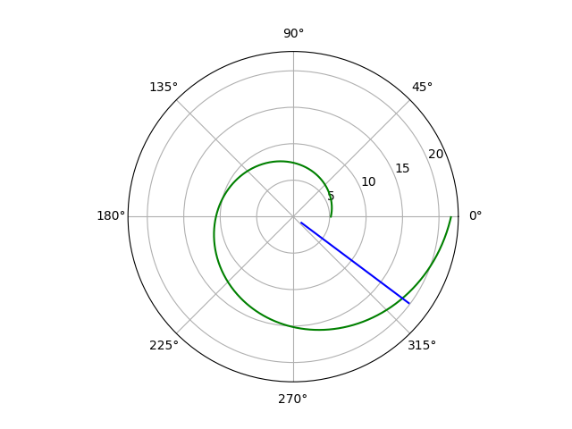
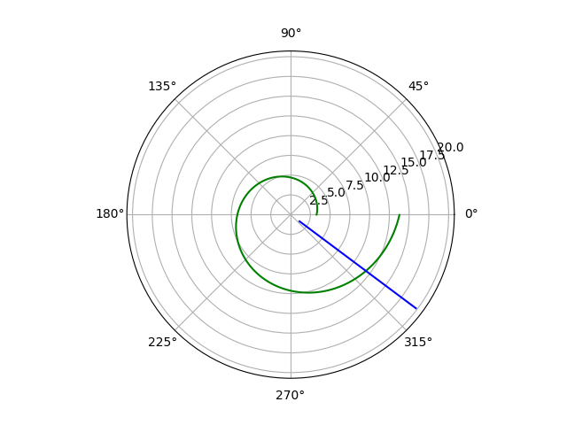

## Прагматика выполнения лабораторной работы(Зачем)
*Изучение основ математического моделирование 

## Цель работы
Научиться выводить уравнение, описывающее движение катера, а также строить график траектории движения на примере задачи о погоне.

## Задачи
1. Записать уравнение, описывающее движение катера, с начальными
условиями для двух случаев (в зависимости от расположения катера
относительно лодки в начальный момент времени).
2. Построить траекторию движения катера и лодки для двух случаев.
3. Найти точку пересечения траектории катера и лодки 

## Результат
В данной лабораторной работе я научилась строить уравнение, описывающее движение катера; строить траекторию движения катера и лодки с помощью Python, а также находить точку пересечения траектории катера и лодки.

(рис. -@fig:001)

{ #fig:001 width=70% }

(рис. -@fig:002)

{ #fig:002 width=70% }

