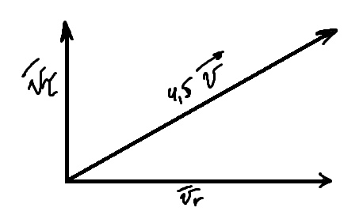
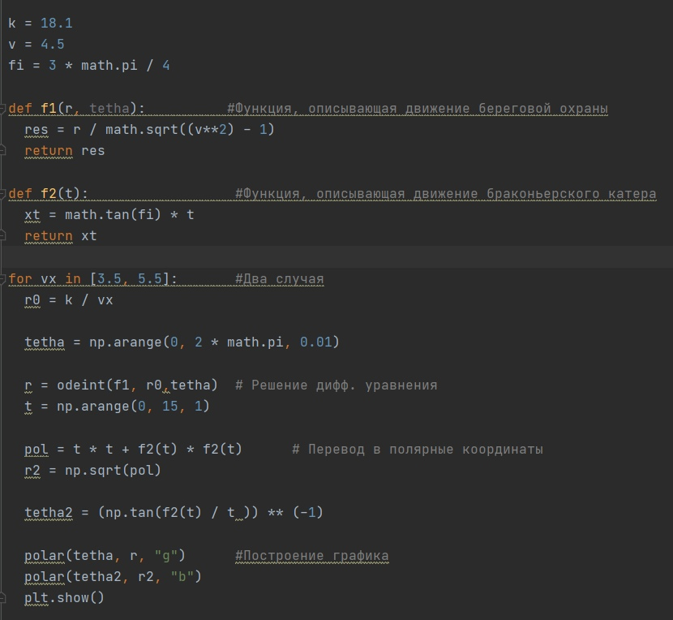
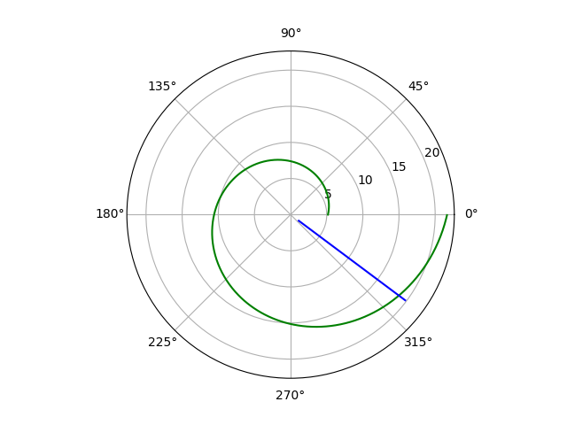
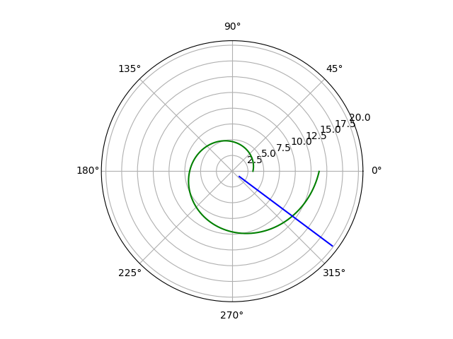

---
# Front matter
lang: ru-RU
title: "Отчет лабораторной № 2"
subtitle: "Задача о погоне"
author: "Хохлачева Яна Дмитриевна"

# Formatting
toc-title: "Содержание"
toc: true # Table of contents
toc_depth: 2
lof: true # List of figures
lot: true # List of tables
fontsize: 12pt
linestretch: 1.5
papersize: a4paper
documentclass: scrreprt
polyglossia-lang: russian
polyglossia-otherlangs: english
mainfont: PT Serif
romanfont: PT Serif
sansfont: PT Sans
monofont: PT Mono
mainfontoptions: Ligatures=TeX
romanfontoptions: Ligatures=TeX
indent: true
pdf-engine: lualatex
header-includes:
  - \linepenalty=10 # the penalty added to the badness of each line within a paragraph (no associated penalty node) Increasing the value makes tex try to have fewer lines in the paragraph.
  - \interlinepenalty=0 # value of the penalty (node) added after each line of a paragraph.
  - \hyphenpenalty=50 # the penalty for line breaking at an automatically inserted hyphen
  - \exhyphenpenalty=50 # the penalty for line breaking at an explicit hyphen
  - \binoppenalty=700 # the penalty for breaking a line at a binary operator
  - \relpenalty=500 # the penalty for breaking a line at a relation
  - \clubpenalty=150 # extra penalty for breaking after first line of a paragraph
  - \widowpenalty=150 # extra penalty for breaking before last line of a paragraph
  - \displaywidowpenalty=50 # extra penalty for breaking before last line before a display math
  - \brokenpenalty=100 # extra penalty for page breaking after a hyphenated line
  - \predisplaypenalty=10000 # penalty for breaking before a display
  - \postdisplaypenalty=0 # penalty for breaking after a display
  - \floatingpenalty = 20000 # penalty for splitting an insertion (can only be split footnote in standard LaTeX)
  - \raggedbottom # or \flushbottom
  - \usepackage{float} # keep figures where there are in the text
  - \floatplacement{figure}{H} # keep figures where there are in the text
---

# Цель работы

Научиться выводить уравнение, описывающее движение катера, а также строить график траектории движения на примере задачи о погоне.

# Задание

На море в тумане катер береговой охраны преследует лодку браконьеров.
Через определенный промежуток времени туман рассеивается, и лодка
обнаруживается на расстоянии 18,1 км от катера. Затем лодка снова скрывается в
тумане и уходит прямолинейно в неизвестном направлении. Известно, что скорость
катера в 4,5 раза больше скорости браконьерской лодки.

1. Запишите уравнение, описывающее движение катера, с начальными
условиями для двух случаев (в зависимости от расположения катера
относительно лодки в начальный момент времени).
2. Постройте траекторию движения катера и лодки для двух случаев.
3. Найдите точку пересечения траектории катера и лодки 

# Выполнение лабораторной работы
1. Место нахождения лодки браконьеров в момент обнаружения: $t_0 = 0, x_{l0} = 0$ . Место нахождения катера береговой охраны относительно лодки браконьеров в момент обнаружения лодки: $x_{k0} = 0$

2. Введем полярные координаты. Считаем, что полюс - это точка обнаружения лодки браконьеров $x_{l0} (0 = x_{l0} = 0)$ , а полярная ось r проходит через точку нахождения катера береговой охраны.
3. Траектория катера должна быть такой, чтобы и катер, и лодка все время были на одном расстоянии от полюса, только в этом случае траектория катера пересечется с траекторией лодки. Поэтому для начала катер береговой охраны должен двигаться некоторое время прямолинейно, пока не окажется на том же расстоянии от полюса, что и лодка браконьеров. После этого катер береговой охраны должен двигаться вокруг полюса удаляясь от него с той же скоростью, что и лодка браконьеров.

4. Чтобы найти расстояние $X$ (расстояние, после которого катер начнет двигаться вокруг полюса), необходимо составить простое уравнение. Пусть через время t катер и лодка окажутся на одном расстоянии $x$ от полюса. За это время лодка пройдет $x$, а катер — $k - x$ (или $k + x$ в зависимости от начального положения катера относительно полюса). Время, за которое они пройдут это расстояние, вычисляется как $x/v$ или ${k-x}/4.5v$ (во втором случае ${k+x}/4.5v$). Так как время одно и то же, то эти величины одинаковы. Тогда неизвестное расстояние $x$ можно найти из следующего уравнения: $$ \frac{x}{v} = \frac{k-x}{4.5v}$$ или $$ \frac{x}{v} = \frac{k+x}{4.5v}$$    
Отсюда мы найдем два значения $x_1 = \frac{k}{5.5}$ и $x_2 = \frac{k}{3.5}$ , задачу будем решать для двух случаев.
5. После того, как катер береговой охраны окажется на одном расстоянии от полюса, что и лодка, он должен сменить прямолинейную траекторию и начать двигаться вокруг полюса, удаляясь от него со скоростью лодки $v$. Для этого скорость катера раскладываем на две составляющие: $v_r$ — радиальная скорость и $v_{\tau}$ — тангенциальная скорость. 
Радиальная скорость - это скорость, с которой катер удаляется от полюса, $v_r = \frac{dr}{dt}$. Нам нужно, чтобы эта скорость была равна скорости лодки, поэтому полагаем $\frac{dr}{dt}=v$.
Тангенциальная скорость – это линейная скорость вращения катера относительно полюса. Она равна произведению угловой скорости $\frac{\partial \theta}{\partial t}$ на радиус $r,\ v_{\tau} = r \frac{\partial \theta}{\partial t}$ 
(рис. -@fig:001)

{ #fig:001 width=70% }

Из рисунка (рис. -@fig:001) видно: $v_{\tau} = \sqrt{20.25v^2 - v^2} = \sqrt{19.25}v$ (учитывая, что радиальная скорость равна $v$). Тогда получаем $r \frac{\partial \theta}{\partial t} = \sqrt{19.25}v$

6. Решение исходной задачи сводится к решению системы из двух дифференциальных уравнений:
\begin{equation*} \begin{cases} \frac{\partial r}{\partial t} = v \ r \frac{\partial \theta}{\partial t} = \sqrt{19.25} v \end{cases} \end{equation*}

с начальными условиями

\begin{equation*} \begin{cases} \theta_0 = 0 \ r_0 = x_1 \end{cases} \end{equation*}

\begin{equation*} \begin{cases} \theta_0 = -\pi \ r_0 = x_2 \end{cases} \end{equation*}

Исключая из полученной системы производную по $t$, можно перейти к следующему уравнению: $$ \frac{\partial r}{\partial \theta} = \frac{r}{\sqrt{19.25}}.$$ Начальные условия остаются прежними. Решив это уравнение, мы получим траекторию движения катера в полярных координатах.

# Код
(рис. -@fig:002)

{ #fig:002 width=70% }

(рис. -@fig:003)

{ #fig:003 width=70% }

(рис. -@fig:004)

{ #fig:004 width=70% }

# Выводы

В данной лабораторной работе я научилась строить уравнение, описывающее движение катера; строить траекторию движения катера и лодки с помощью Python, а также находить точку пересечения траектории катера и лодки.
