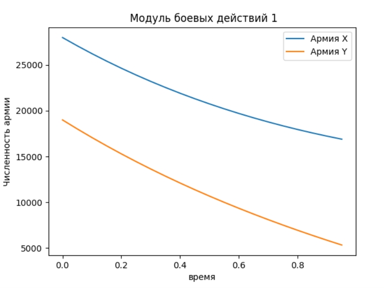

## Прагматика выполнения лабораторной работы(Зачем)
*Изучение основ математического моделирование
*Ознакомление с моделью боевых действий
*Расчет человеческий потерь в прошедших войных, а также расчет прогноза вероятных жертв при потенциальных вооруженных конфликтах.  

## Цель работы
* Рассмотреть простейшие модели боевых действий - модели Ланчестера.
* Построить графики изменения численности войск армии Х и армии У.

## Задачи
Построить графики изменения численности армии для двух случаев:
1. Военные действия между двумя регулярными войсками;
2. Военные действия между регулярным войском и партзанами.

## Результат
В данной лабораторной работе рассмотрела простейшие модели боевых действий - модели Ланчестера, а также я научилась строить графики изменения численности войск армии Х и армии У с помощью Python.

(рис. -@fig:001)

{ #fig:001 width=70% }

(рис. -@fig:002)

{ #fig:002 width=70% }

