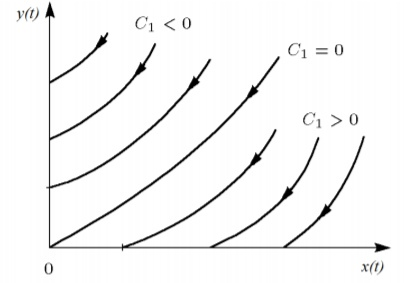

---
# Front matter
lang: ru-RU
title: "Отчет лабораторной № 3"
subtitle: "Модель боевых действий"
author: "Хохлачева Яна Дмитриевна"

# Formatting
toc-title: "Содержание"
toc: true # Table of contents
toc_depth: 2
lof: true # List of figures
lot: true # List of tables
fontsize: 12pt
linestretch: 1.5
papersize: a4paper
documentclass: scrreprt
polyglossia-lang: russian
polyglossia-otherlangs: english
mainfont: PT Serif
romanfont: PT Serif
sansfont: PT Sans
monofont: PT Mono
mainfontoptions: Ligatures=TeX
romanfontoptions: Ligatures=TeX
indent: true
pdf-engine: lualatex
header-includes:
  - \linepenalty=10 # the penalty added to the badness of each line within a paragraph (no associated penalty node) Increasing the value makes tex try to have fewer lines in the paragraph.
  - \interlinepenalty=0 # value of the penalty (node) added after each line of a paragraph.
  - \hyphenpenalty=50 # the penalty for line breaking at an automatically inserted hyphen
  - \exhyphenpenalty=50 # the penalty for line breaking at an explicit hyphen
  - \binoppenalty=700 # the penalty for breaking a line at a binary operator
  - \relpenalty=500 # the penalty for breaking a line at a relation
  - \clubpenalty=150 # extra penalty for breaking after first line of a paragraph
  - \widowpenalty=150 # extra penalty for breaking before last line of a paragraph
  - \displaywidowpenalty=50 # extra penalty for breaking before last line before a display math
  - \brokenpenalty=100 # extra penalty for page breaking after a hyphenated line
  - \predisplaypenalty=10000 # penalty for breaking before a display
  - \postdisplaypenalty=0 # penalty for breaking after a display
  - \floatingpenalty = 20000 # penalty for splitting an insertion (can only be split footnote in standard LaTeX)
  - \raggedbottom # or \flushbottom
  - \usepackage{float} # keep figures where there are in the text
  - \floatplacement{figure}{H} # keep figures where there are in the text
---

# Цель работы
* Рассмотреть простейшие модели боевых действий - модели Ланчестера.
* Построить графики изменения численности войск армии Х и армии У.

# Задание

Между страной Х и страной У идет война. Численность состава войск
исчисляется от начала войны, и являются временными функциями
x(t) и y(t). В начальный момент времени страна Х имеет армию численностью 28 000 человек, а в распоряжении страны У армия численностью в 19 000 человек. Для упрощения модели считаем, что коэффициенты a, b, c, h постоянны. Также считаем P(t) и Q(t) непрерывные функции.
Постройте графики изменения численности войск армии Х и армии У для
следующих случаев:

1. Модель боевых действий между регулярными войсками

$\frac{dx}{dt}=-0,13x(t)-0,78y(t)+sin(t+3)+1$

$\frac{dy}{dt}=-0,51x(t)-0,3y(t)+cos(t+3)+1$

2. Модель ведение боевых действий с участием регулярных войск и
партизанских отрядов

$\frac{dx}{dt}=-0,336x(t)-0,69y(t)+|sin(2t)|$

$\frac{dy}{dt}=-0,35x(t)y(t)-0,41y(t)+|cos(8t)|$


# Выполнение лабораторной работы
Рассмотрим некоторые простейшие модели боевых действий – модели
Ланчестера. В противоборстве могут принимать участие как регулярные войска,
так и партизанские отряды. В общем случае главной характеристикой соперников
являются численности сторон. Если в какой-то момент времени одна из
численностей обращается в нуль, то данная сторона считается проигравшей (при
условии, что численность другой стороны в данный момент положительна).
Рассмотри три случая ведения боевых действий:

1. Боевые действия между регулярными войсками

2. Боевые действия с участием регулярных войск и партизанских
отрядов

    В первом случае численность регулярных войск определяется тремя
факторами:

* скорость уменьшения численности войск из-за причин, не связанных с
боевыми действиями (болезни, травмы, дезертирство);
* скорость потерь, обусловленных боевыми действиями
противоборствующих сторон (что связанно с качеством стратегии,
уровнем вооружения, профессионализмом солдат и т.п.);
* скорость поступления подкрепления (задаётся некоторой функцией от
времени).
    В этом случае модель боевых действий между регулярными войсками
описывается следующим образом

$\frac{dx}{dt}=-0,336x(t)-0,69y(t)+|sin(2t)|$

$\frac{dy}{dt}=-0,35x(t)y(t)-0,41y(t)+|cos(8t)|$

(1)

    
    Потери, не связанные с боевыми действиями, описывают члены -a(t)x(t) и
-h(t)y(t), члены -b(t)y(t) и -c(t)x(t) отражают потери на поле боя.
Коэффициенты b(t) и c(t) указывают на эффективность боевых действий со
стороны у и х соответственно, a(t),h(t) - величины, характеризующие степень
влияния различных факторов на потери. Функции P(t),Q(t) учитывают 
возможность подхода подкрепления к войскам Х и У в течение одного дня.

    Во втором случае в борьбу добавляются партизанские отряды. Нерегулярные
войска в отличии от постоянной армии менее уязвимы, так как действуют скрытно,
в этом случае сопернику приходится действовать неизбирательно, по площадям,
занимаемым партизанами. Поэтому считается, что тем потерь партизан,
проводящих свои операции в разных местах на некоторой известной территории,
пропорционален не только численности армейских соединений, но и численности
самих партизан. В результате модель принимает вид:

$\frac{dx}{dt}=-0,336x(t)-0,69y(t)+|sin(2t)|$

$\frac{dy}{dt}=-0,35x(t)y(t)-0,41y(t)+|cos(8t)|$

(2)

    В этой системе все величины имею тот же смысл, что и в системе (1)

Если рассматривать второй случай (война между регулярными войсками и партизанскими отрядами) с теми же упрощениями, то модель принимает вид:

$$ \begin{cases} \frac{dx}{dt}= -by(t) \
\frac{dy}{dt}= -cx(t)y(t) \end{cases} $$

Эта система приводится к уравнению $\frac{d}{dt}= (\frac{b}{2}x^2(t)-cy(t))=0$ которое при заданных начальных условиях имеет единственное решение: $\frac{b}{2}x^2(t)-cy(t)=\frac{b}{2}x^2(0)-cy(0)=C_1$

{ #fig:001 width=70% height=70% }

Из Рисунка @fig:002 видно, что при $C_1>0$ побеждает регулярная армия, при $C_1<0$ побеждают партизаны. Аналогично противоборству регулярных войск, победа обеспечивается не только начальной численностью, но и боевой выручкой и качеством вооружения. При $C_1>0$ получаем соотношение $\frac{b}{2}x^2(0)>cy(0)$ Чтобы одержать победу партизанам необходимо увеличить коэффициент $c$ и повысить свою начальную численность на соответствующую величину. Причем это увеличение, с ростом начальной численности регулярных войск $x(0)$ должно расти не линейно, а пропорционально второй степени $x(0)$ . Таким образом, можно сделать вывод, что регулярные войска находятся в более выгодном положении, так как неравенство для них выполняется прим меньшем росте начальной численности войск. Рассмотренные простейшие модели соперничества соответствуют системам обыкновенных дифференциальных уравнений второго порядка, широко распространенным при описании многих естественно научных объектов.

# Код на Python: 
```
import math
import numpy as np
from scipy.integrate import odeint
import matplotlib.pyplot as plt

#начальные условия
x0 = 28000 #численность первой армии
y0 = 19000 #численность второй армии
t0 = 0 #начальный момент времени

a = 0.13 #константа, характеризующая степень влияния различных факторов на потери
b = 0.78 #эффективность боевых действий армии у
c = 0.51 #эффективность боевых действий армии х
h = 0.3 #константа, характеризующая степень влияния различных факторов на потери

# Между регулярными и партизанами:
a2 = 0.336 #константа, характеризующая степень влияния различных факторов на потери
b2 = 0.69 #эффективность боевых действий армии у
c2 = 0.35 #эффективность боевых действий армии х
h2 = 0.41 #константа, характеризующая степень влияния различных факторов на потери


tmax = 1 #предельный момент времени
dt = 0.05 #шаг изменения времени
t = np.arange(t0, tmax, dt)

#возможность подхода подкрепления к армии х
def P(t):
  p = np.sin(t + 3) + 1
  return p


#возможность подхода подкрепления к армии у
def Q(t):
  q = np.cos(t + 3) + 1
  return q


# Второй случай
def P2(t):
  p2 = abs(np.cos(2*t))
  return p2

def Q2(t):
  q2 = abs(np.sin(8*t))
  return q2

#Система дифференциальных уравнений
def System(y, t):
  dy1 = - a * y[0] - b * y[1] + P(t) #изменение численности первой армии
  dy2 = - c * y[0] - h * y[1] + Q(t) #изменение численности второй армии
  return dy1, dy2

def Syst2(y, t):
  dy21 = - a2 * y[0] - b2 * y[1] + P2(t) #изменение численности первой армии
  dy22 = - c2 * y[0] * y[1] - h2 * y[1] + Q2(t) #изменение численности второй армии
  return dy21, dy22

#Вектор начальных условий
v0 = np.array([x0, y0])

# Решение системы
y1 = odeint(System, v0, t)
y2 = odeint(Syst2, v0, t)


# Построение графиков решений
plt.plot(t, y1)
plt.title(' Модуль боевых действий 1')
plt.ylabel('Численность армии')
plt.xlabel('время')
plt.legend(['Армия X','Армия Y'])
plt.show()


plt.title(' Модуль боевых действий 2')
plt.plot(t, y2)
plt.ylabel('Численность армии')
plt.xlabel('время')
plt.legend(['Армия X','Армия Y'])
plt.show()
```


(рис. -@fig:001)

{ #fig:002 width=70% }


(рис. -@fig:002)

{ #fig:003 width=70% }

# Выводы

В данной лабораторной работе рассмотрела простейшие модели боевых действий - модели Ланчестера, а также я научилась строить графики изменения численности войск армии Х и армии У с помощью Python.
