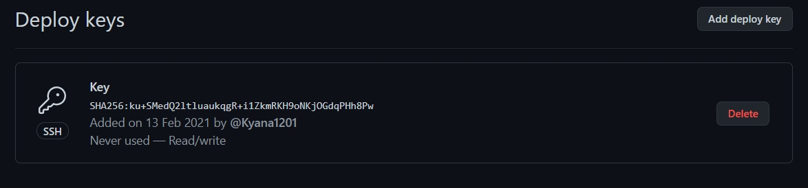

---
# Front matter
lang: ru-RU
title: "Отчет лабораторной № 1"
subtitle: "Git,Markdown"
author: "Хохлачева Яна Дмитриевна"

# Formatting
toc-title: "Содержание"
toc: true # Table of contents
toc_depth: 2
lof: true # List of figures
lot: true # List of tables
fontsize: 12pt
linestretch: 1.5
papersize: a4paper
documentclass: scrreprt
polyglossia-lang: russian
polyglossia-otherlangs: english
mainfont: PT Serif
romanfont: PT Serif
sansfont: PT Sans
monofont: PT Mono
mainfontoptions: Ligatures=TeX
romanfontoptions: Ligatures=TeX
indent: true
pdf-engine: lualatex
header-includes:
  - \linepenalty=10 # the penalty added to the badness of each line within a paragraph (no associated penalty node) Increasing the value makes tex try to have fewer lines in the paragraph.
  - \interlinepenalty=0 # value of the penalty (node) added after each line of a paragraph.
  - \hyphenpenalty=50 # the penalty for line breaking at an automatically inserted hyphen
  - \exhyphenpenalty=50 # the penalty for line breaking at an explicit hyphen
  - \binoppenalty=700 # the penalty for breaking a line at a binary operator
  - \relpenalty=500 # the penalty for breaking a line at a relation
  - \clubpenalty=150 # extra penalty for breaking after first line of a paragraph
  - \widowpenalty=150 # extra penalty for breaking before last line of a paragraph
  - \displaywidowpenalty=50 # extra penalty for breaking before last line before a display math
  - \brokenpenalty=100 # extra penalty for page breaking after a hyphenated line
  - \predisplaypenalty=10000 # penalty for breaking before a display
  - \postdisplaypenalty=0 # penalty for breaking after a display
  - \floatingpenalty = 20000 # penalty for splitting an insertion (can only be split footnote in standard LaTeX)
  - \raggedbottom # or \flushbottom
  - \usepackage{float} # keep figures where there are in the text
  - \floatplacement{figure}{H} # keep figures where there are in the text
---

## Цель работы

Освосить работу с системой контроля версии Git, а также и познакомиться
с основными возможностями разметки Markdown.

## Задание

1. Создение репозитория
2. Загрузка каталога 
3. Создание commit и загрузка файла
4. Создание ssh-ключа
5. Создание отчета с помощью Markdown
6. Создание презентации с помощью Markdown

# Выполнение лабораторной работы

1. Создала репозиторий( рис. 1 )
 

2. Добавила каталог(рис. 2 )
  
  

3. Создала commit и загрузила файл(рис. 3)
  

( рис. 4)
  
   
( рис. 5 )
  
   

4. Создала ssh-ключ(рис. 6 ) 
  
   
( рис. 7 )
  
   

# Выводы

В данной лаборатной работе я освоила азы работы с системой контроля Git и возможностями разметки Markdown.
